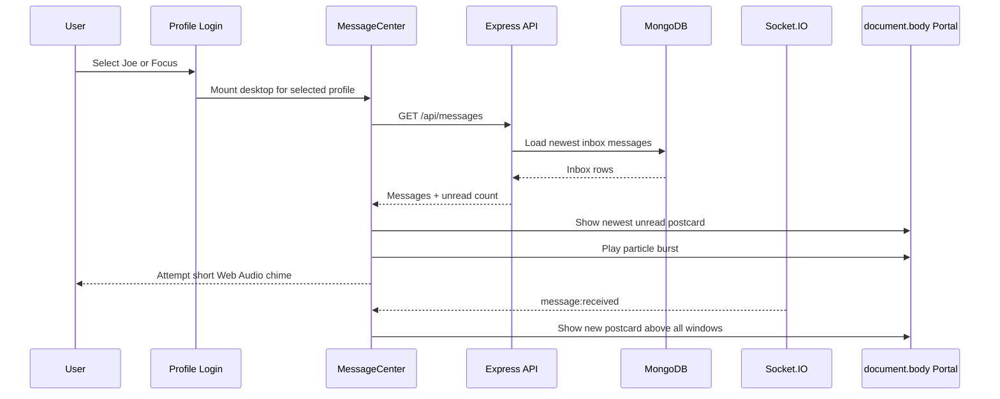

# Letter & Alert Experience

Status: Implemented  
Updated: 2026-09-13

## Goal

Make letters and alerts easy to notice and open after profile login without letting desktop windows cover them. The experience stays compact on phones and adds playful, sender-configurable motion and a short glass-like sound effect.

## Code review findings

### Critical

- `MessageCenter` previously rendered inside `.topbar`. The top bar creates a stacking context, so child overlays could not rise above desktop windows even when the child had a larger `z-index`.

### Major

- The incoming card inherited the generic dialog height and scrolling behavior. Long messages could make the notification too tall and move its actions away from the thumb/cursor.
- Socket reconnects could increment an existing message twice.
- A read receipt could decrement the unread badge twice when the HTTP response and Socket.IO event arrived in different orders.
- Sent messages were inserted into the inbox state even though the inbox endpoint only returns received messages.

### Positive patterns retained

- Messages remain persisted in MongoDB and are delivered live through profile-specific Socket.IO rooms.
- Server validation controls message length, recipient, message type, animation name, and idempotency key.
- The existing shared `GlassDialog` continues to provide keyboard focus trapping and Escape-to-close behavior.

## Visual direction

The design theme is **Love Postcard in Orbit**: a compact glass postcard arrives above the dock while a short burst of symbols crosses the wallpaper.

### Tokens

| Role | Token |
| --- | --- |
| Neon Lime | `#b6ff00` |
| Royal Blue | `#2453ff` |
| Deep Space | `#06113e` |
| Letter White | `#eff5ff` |
| Dream Cyan | `#9cecff` |
| Heart Pink | `#ff8fa5` |

- Display/body: Manrope
- Utility labels and timestamps: DM Mono
- Signature element: sender-selected emoji orbit plus a one-shot full-screen particle burst

### Compact layout

```text
Desktop mailbox                         Incoming postcard
┌──────────────────────────────────┐    ┌────────────────────────┐
│ Mailbox          sound   compose │    │ 💌  From Joe        ×  │
├──────────────┬───────────────────┤    │ Short subject          │
│ message list │ selected letter   │    │ 2–3 line preview       │
│ scrolls here │ scrolls here      │    │ Later      Open letter │
└──────────────┴───────────────────┘    └────────────────────────┘

Mobile mailbox
┌───────────────────────┐
│ sound         compose │
├───────────────────────┤
│ compact message list  │
├───────────────────────┤
│ selected letter only  │
└───────────────────────┘
```

## Runtime architecture



## ADR-001: Render transient communication UI in a body portal

### Status

Accepted

### Context

Desktop windows have persisted and increasing z-order values. The old message UI lived inside the top bar's stacking context and could be covered by an expanded item window.

### Decision

Render the mailbox through `GlassDialog` and render the incoming postcard/celebration directly into `document.body` with React portals. Reserve a high overlay layer for modal, celebration, and incoming-card surfaces.

### Consequences

Positive:

- Incoming messages and the mailbox remain clickable above every desktop window.
- The overlay does not depend on the current top bar or window z-order.
- Shared dialog keyboard behavior remains reusable.

Negative:

- Overlay layer tokens must remain centralized and should not be copied into feature components.
- Portaled UI must be tested separately from its trigger button when component tests are added.

### Alternatives considered

- Increase the old child `z-index`: rejected because a child cannot escape its parent's stacking context.
- Reset all persisted window z values on every click: rejected because it adds database traffic and does not solve other stacking contexts.
- Add a motion/audio library: deferred because CSS keyframes and Web Audio cover the current effects with no bundle dependency.

## Implemented phases

### Phase 1 — Layering and compact UI

- [x] Move mailbox and incoming notification to body portals.
- [x] Place overlays above persisted desktop windows.
- [x] Clamp notification text to two lines on phones and three lines on desktop.
- [x] Limit card height and keep both actions visible.
- [x] Use independent scroll areas inside the mailbox.
- [x] Add responsive one-column mailbox behavior.

### Phase 2 — Login and realtime delivery

- [x] Fetch the selected profile's inbox when `MessageCenter` mounts after login.
- [x] Show the newest unread message automatically.
- [x] Queue additional unread messages after the current message is dismissed.
- [x] Clear inbox state when leaving the desktop so profiles cannot briefly see stale state.
- [x] Deduplicate replayed Socket.IO events and read receipts.

### Phase 3 — Playful effects

- [x] Keep `hearts`, `sparkles`, and custom `emoji-rain`.
- [x] Add `confetti`, `bubbles`, and `stars` presets.
- [x] Add a deterministic full-screen particle burst for stable React renders.
- [x] Add a smaller emoji orbit inside the postcard and letter detail.
- [x] Add a three-note Web Audio chime with an inbox sound toggle.
- [x] Disable movement when `prefers-reduced-motion: reduce` is enabled.
- [x] Fall back silently when browser autoplay/audio initialization is blocked.

### Phase 4 — Documentation and verification

- [x] Add JSDoc to public effect and message-state helpers.
- [x] Add client unit tests for effect fallback, deterministic particles, unread selection, reconnect deduplication, read receipts, and sound failure.
- [x] Extend backend validation tests for the three new animation presets.
- [x] Verify production frontend build.

## Files

- `client/src/components/MessageCenter.jsx` — mailbox, incoming postcard, compose UI, portals, sound preference
- `client/src/lib/letterEffects.js` — pure effect configuration, particles, unread selection, Web Audio chime
- `client/src/lib/messageState.js` — order-independent realtime inbox merges
- `client/src/styles.css` — compact glass surfaces, overlay layers, responsive rules, keyframes
- `server/src/models/Message.js` — canonical animation enum
- `server/src/routes/messages.js` — request validation using the canonical enum

## Non-functional requirements

- Responsive down to 320 px viewport width.
- No pointer-blocking layer outside the visible postcard; celebration particles use `pointer-events: none`.
- Inbox/message content never executes HTML; React renders it as text.
- At most 22 transient particles are mounted for about 4.3 seconds.
- Audio is generated locally and no audio file or third-party request is required.
- The sound preference is stored locally per browser; message content remains server-side.

## Verification

```bash
npm test --prefix client
npm run build --prefix client
npm test --prefix server
```

Expected:

- Client helper tests pass with at least 85% line coverage.
- Vite production build completes.
- Server model tests accept all supported animation presets and reject unknown values.

## Manual QA checklist

- [ ] Login as Joe with unread Focus messages; the newest postcard appears after the desktop loads.
- [ ] Expand and focus several desktop windows; the postcard and mailbox remain above them and clickable.
- [ ] Dismiss one unread postcard; the next unread postcard appears.
- [ ] Open a postcard; its unread badge decreases exactly once.
- [ ] Send each effect from Joe to Focus and verify the selected visual is delivered.
- [ ] Disable sound, refresh, and confirm the preference persists.
- [ ] Test at 320 px, 390 px, tablet, and desktop widths.
- [ ] Enable reduced motion and confirm particles/orbit/card motion stop.
- [ ] Test a 5,000-character message; the postcard remains compact and the full text scrolls in the mailbox.
