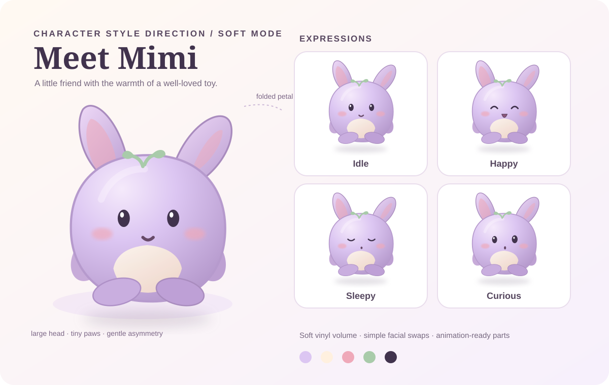

# Soft vinyl companion — character direction

## Character idea

**Mimi** is a palm-sized, softly squashed companion with a large pear-shaped head, a tiny rounded body, short paws, and two unequal petal ears. The folded right ear is the recognition cue: it stays visible in every pose and at small sizes. A cream belly patch, peach cheeks, and a tiny bean-shaped mouth make the face warm without adding costume detail.

The reference sheet is an art direction sample for the app's **Soft** mode, not a new species or a replacement for every saved companion. Carry its material, proportions, facial grammar, and shading into the existing spirit, bunny, cat, fox, dragon, robot, child, and custom form grammar. Each species keeps its own ears, tail, and evolved silhouette.

## Shape and material rules

- Head occupies about 62% of the visible character height; body about 25%; feet and ears take the rest. The silhouette reads as a toy at 96 px and as a character at 256 px.
- Use continuous curves and slightly uneven symmetry. The right ear bends outward and down; the left ear stands taller. Avoid sharp corners and perfect mirrored geometry.
- Eyes are dark plum ovals with one small highlight. Keep them far enough apart to read at 96 px. Mouth is a short curved bean below the eyes; cheeks are softly blurred ovals.
- Use a warm cream key highlight on the upper left, a lavender shadow on the lower right, and a soft contact shadow beneath the feet. Keep the finish matte like soft vinyl; no hard plastic glare or heavy texture.
- Keep markings to the belly patch and a tiny forehead sprout. Do not add clothing, accessories, outlines around every part, or decorative face details that compete with the expression.

## Palette

| Role | Color | Use |
| --- | --- | --- |
| Body | `#DCC6F2` | Main lavender vinyl |
| Highlight | `#F5EAFB` | Upper-left volume |
| Shadow | `#B69ACD` | Lower-right volume and folds |
| Belly | `#FFF0DF` | Warm cream inset |
| Cheeks | `#EFA9B9` | Soft blush |
| Eyes and mouth | `#41334D` | Clear expression |
| Sprout | `#A9CBAA` | Small distinguishing accent |

For user-selected palettes, derive highlights by mixing the body color toward warm white and shadows toward muted plum. Keep eyes dark enough to remain readable against the lightest body option. Blush should remain warm but can be reduced when it conflicts with a saturated palette.

## Expression and motion grammar

| State | Face | Body action |
| --- | --- | --- |
| Idle | Open oval eyes, tiny smile | 2–3% breathing scale over 2.8 s; blink every 4–7 s |
| Happy / play | Upswept closed eyes, open bean mouth | Short squash, then one 8–12 px hop; ears lag behind |
| Sleep | Gentle closed arcs, mouth reduced to a dot | Body settles 4 px; slow breathing, no bounce |
| Curious | One eye slightly wider, mouth tilted | Head tilts 7°; folded ear follows with a short delay |

Keep face parts separate from the body so blinking and expression swaps do not redraw the whole creature. Anchor the mouth and cheeks to the face. Anchor the ears and arms to the body with independent transforms. Use the existing animation-off setting and `prefers-reduced-motion` to render a clear still pose. Never use a constant bounce while sleeping.

## Growth and app use

This direction should survive the existing hatchling → child → juvenile → grown/elder progression. At each stage change the silhouette and at least two anatomical features; color changes or a badge alone do not count. The folded ear or an equivalent species-specific asymmetry can persist as an identity marker. Keep the soft renderer in SVG/CSS parts, as specified in [the companion UI handoff](../handoff/04-companion-game-ui.md). The reference SVG is editable source art for proportions and color, not a flattened animation sprite.

The current Soft renderer applies the palette, volume, belly patch, and soft facial treatment in `CompanionAvatar.tsx` and `companion.css`. Spirit, bunny, and custom forms use the folded ear; pointed-ear and robot forms keep their own silhouettes. Existing saved colors and face choices continue to drive the result.
